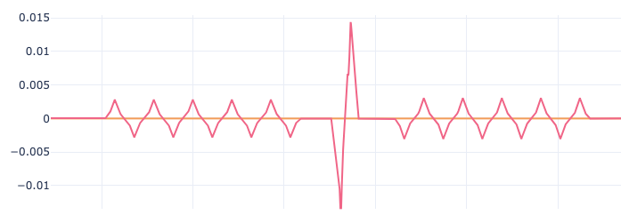
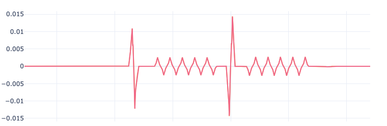
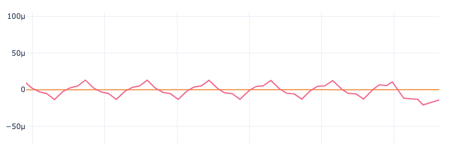
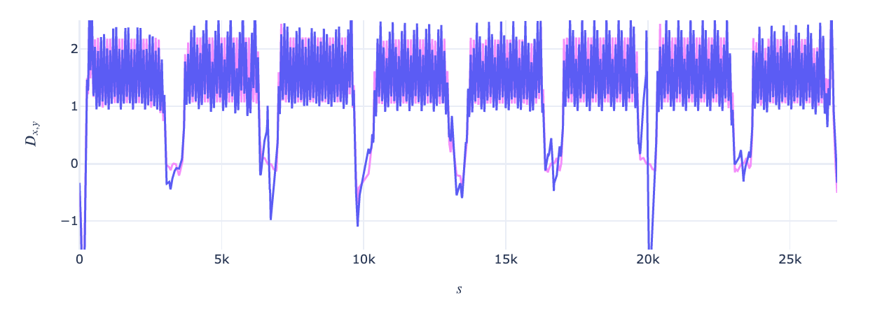
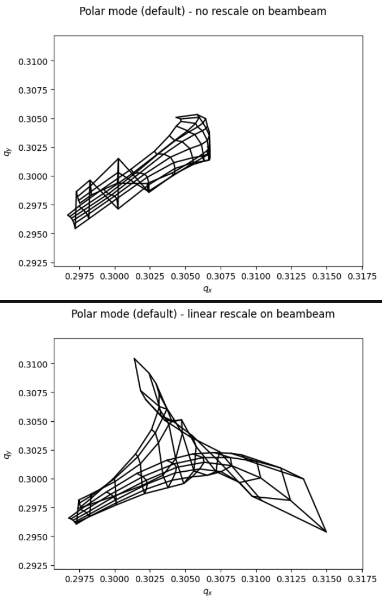

# Questions

## Xmask questions

* Why are some bb elements already in the twiss after just building the collider (but not setting the beam-beam elements yet)? 
E.g. ```collider.lhcb1.twiss(method="4d").rows["ip4":"ip6", "bb.*"].cols["s"]``` yields:

```python
TwissTable: 2 rows, 18 cols
name                       s
bblr.4l5.b1           6471.7
bblr.4r5.b1          6852.64
```

Are these just markers used later to know where to place the bb elements?
  
<br/>
            
* Is it the file core_co_lhcb1 that (undirectly ?) contains the orbit bumps observed in x and y (c.f. figure below) after configuring knobs and tuning?



*x position of the beam before (orange) and after (red) configuring knobs and tuning*

<br/> 

* Is there a possibility to select a given bunch to track in the config file? Along with a given filling scheme?

<br/> 

* How can I scan the following paramerers e.g. for a DA study?
  * tune/chromaticity -> Should I just use ```xm.machine_tuning()```? Do the beam-beam interactions have to be reconfigured?
  * crossing angle/octupole polarity -> Should I just change the knob through e.g. ```collider.vars[on_x5] = x``` or ```collider.vars[i_oct_b1] = x```? Do I have to subsequently rematch tune and chromaticity, and reconfigure the beam-beam interactions?
  * bunch number
  More generally, which parameters can be scanned from an existing collider, and which ones require a new collider to be built?

<br/> 

* Why does the config file contain different parameters than the config file from lhcmask?
  * beam_sigt, beam_sige have been removed
  * lagrf400.b1, lagrf400.b2 have been added
  * All luminosity parameters have been removed
  * z_crab_twiss has been replaced by sigma_z?
  * knob_names are different. How do I handle the knobs that don't work anymore, e.g. 'on_x8v'?

More generally, how can I ensure the machine I build with xmask is the same as the one built with lhcmask? For now, I don't manage to obtain the same tune footprint depending if I use lhcmask or xmask (but the config files can't be identical, because of the changes above).

## More general questions

* Why, in the final collider, is the closed orbit reference nearly undistinguishable from the beam orbit? Cf. figure below:
  


*x position of the beam before (orange) and after (red) configuring knobs and tuning*

Conversely, when zooming in, where do the small discrepancies come from? Why is it the reference orbit that is oscillating around the actual beam orbit, and not the opposite? Cf. figure below, which is zoomed in the left part of the previous figure:


*x position of the beam before (orange) and after (red) configuring knobs and tuning, zoomed in for s<1000*

<br/> 


* Why is dispersion worse after configuring knobs and tuning, and therefore setting ```on_disp``` to 1? Cf. figure below:



*Horizontal dispersion before (pink) and after (purple) configuring knobs and tuning*

<br/>

* Are the footprints that we obtain for flat optics expected? They seem very different, and less smooth than the ones from round optics. Cf. figure below:



*Footprints of the beam for flat optics*
